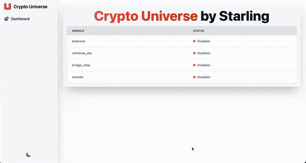

# Crypto Universe


## Getting Started

To get a local copy of this project up and running, follow these simple steps.

### Installation

1. Clone the repository:

   ```bash
   git clone https://github.com/starling114/crypto-universe.git
   ```

2. Navigate to the project directory:

   ```bash
   cd crypto-universe
   ```

3. Install Node.js dependencies:

   ```bash
   npm install
   ```

4. Set up the Python environment:

    Navigate to the `scripts` directory:

    ```bash
    cd scripts
    ```

    Create a virtual environment:

    ```bash
    python -m venv myenv
    ```

    Activate the virtual environment:

    ```bash
    source myenv/bin/activate
    ```

    Install the required Python packages:

    ```bash
    pip install -r requirements.txt
    ```

### Running the Application

Once you have installed all dependencies and set up the Python environment, you can start the application with the following command from the root directory:

```bash
npm start
```

The server will start on [http://localhost:3000](http://localhost:3000). You can open this URL in your web browser to view the application.

## Features

### 1. Balances

- Read balances on provided EVM addresses across various networks: Ethereum, Arbitrum, Optimism, Polygon, BSC, Base, and Blast.
- To configure addresses, visit settings page (icon in the Balances menu item on the right).
- Specific networks can be enabled or disabled in `backend/modules/balances/configs.js`.

### 2. Withdraw OKX

- Withdraw funds from OKX using API integration to specified addresses.
- To configure this feature, visit settings page (icon in the Withdraw -> OKX menu item on the right).

### 3. Bridge Relay

- Bridge funds via relay from one network to another using specified addresses.
- To configure this feature, visit settings page (icon in the Bridge -> Relay menu item on the right) to enter addresses and their private keys.

### 3. Transfer

- Transfer funds from one wallet to another using specified addresses.
- To configure this feature, visit settings page (icon in the Transfer menu item on the right) to enter addresses and their private keys.

### Python Scripts configuration and execution

For the Python scripts, there are two configuration files:

- **Configs**: Located under `scripts/modules/NAME_OF_MODULE/configs.json`, these files store configurations needed for the scripts. UI also shows options (in selects, etc.) based on these files.
- **Instructions**: Located under `scripts/modules/NAME_OF_MODULE/instructions.json`, these files store instructions needed to run each script.
- **Secrets**: Located under `scripts/modules/NAME_OF_MODULE/secrets.json`, these files store sensitive information needed for the scripts, such as API keys and private keys.

## Running scripts

You could also run python scripts without UI:

Navigate to the `scripts` directory:

```bash
cd scripts
```

Run `main.py`:

```bash
python main.py
```

Follow menu and choose module.

Additionaly run specified module via:

```bash
python main.py MODULE_NAME
```
